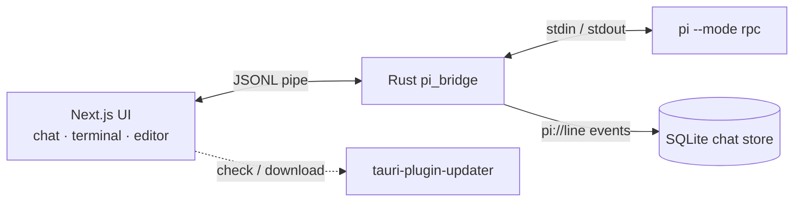

<div align="center">
  
  <h1>Pi Desktop</h1>
  <p><b>An iOS-style desktop home for your <code>pi</code> coding agent.</b></p>
  <p>Chat, terminal, editor, and project files — unified in one frosted-glass window that drives the <i>real</i> <code>pi</code> CLI.</p>
  <p>
    <a href="https://github.com/MarshallEriksen-Neura/pi-agent-desktop/releases">Download</a>
    ·
    <a href="#quick-start">Quick start</a>
    ·
    <a href="#how-it-works">How it works</a>
    ·
    <a href="#community--updates">Community</a>
    ·
    <a href="./README.zh-CN.md">中文</a>
  </p>
</div>

<p align="center">
  
  
  
  
</p>

## Demo

<div align="center">
  <video src="./media/pi-video.mp4" controls width="760">
    Your browser does not support the video tag. You can <a href="./media/pi-video.mp4">download it here</a>.
  </video>
  <p><i>Pi Desktop in action — AI chat, the live terminal, and the code editor sharing one workspace.</i></p>
</div>

## Why Pi Desktop

Most "AI coding" tools are either a chat box bolted onto an editor, or a heavy IDE you have to learn. Pi Desktop takes a different line: it is a **thin, native shell that wraps the `pi` CLI you already use** — and makes it feel at home on the desktop.

- **It runs the real `pi`.** Not a reimplementation and not a web wrapper. The Rust layer spawns `pi --mode rpc` and bridges it over a pipe, so every capability of your CLI is right there.
- **It gets out of the way.** A borderless, transparent, frosted-glass window with custom controls — built to disappear while you work.
- **One shared context.** Chat reads the live terminal, the editor shows the code, and files are a sidebar away. Nothing is siloed.

## Features

- **iOS-style UI** — borderless / transparent window (mica / acrylic), custom window controls, motion-driven animations.
- **Real `pi` process** — Rust spawns `pi --mode rpc` and bridges a bidirectional JSONL pipe; a Mock transport lets you preview in the browser.
- **Built-in terminal** — an xterm terminal shares context with chat, so the agent can see the live shell.
- **Code editor** — CodeMirror 6 with syntax highlighting and interactive code blocks.
- **Local-first persistence** — chat history is saved in SQLite and works fully offline.
- **Built-in auto-update** — `tauri-plugin-updater` produces a signed `latest.json` for one-click in-app updates.
- **Truly cross-platform** — one build yields Windows (NSIS / MSI), macOS (DMG), and Linux (AppImage / deb / rpm).

## Quick start

> [!NOTE]
> Pi Desktop is a GUI for the `pi` CLI. Install `pi` on your machine first — the desktop app drives it in RPC mode.

Download the latest build for your platform from [GitHub Releases](https://github.com/MarshallEriksen-Neura/pi-agent-desktop/releases).

#### Windows

Download `Pi_0.1.0_x64-setup.exe` or `Pi_0.1.0_x64_en-US.msi` and run it.

> [!WARNING]
> The installers are not code-signed yet. If SmartScreen blocks the first launch, click **Run anyway**.

#### macOS

Download `Pi_0.1.0_aarch64.dmg` or `Pi_0.1.0_x64.dmg`.

> [!WARNING]
> Apple notarization is not set up yet. On first launch, allow it in **System Settings → Privacy & Security**, or right-click and choose **Open** to bypass Gatekeeper.

#### Linux

Download the `.AppImage` / `.deb` / `.rpm` and install it the usual way.

## How it works



- **Rust bridge** (`src-tauri/src/pi_bridge.rs`) — spawns `pi --mode rpc`, forwards each stdout JSONL line to the frontend as a `pi://line` event (`pi_send` writes back to stdin).
- **Transport layer** (`src/lib/pi/client.ts`) — `TauriTransport` (real process) / `MockTransport` (browser) are selected at runtime via `isTauri()`.
- **Protocol** (`src/lib/pi/protocol.ts`) — every RPC command and event, strict JSONL (one JSON object per LF-delimited line).
- **State** — zustand stores (`usePi` / `chat` / `useUI`); `agent-bridge.ts` maps pi tool events into UI agent-task state.

The frontend is a Next.js App Router static export (`output: "export"`) — all pages are client-rendered, and the borderless window chrome is drawn by the app itself.

## Auto-update

The desktop app ships `tauri-plugin-updater`:

- Each CI build generates a `.sig` signature per bundle (minisign; the private key is never committed).
- A publish script assembles `latest.json` and uploads it to the Release.
- The in-app `check()` fetches `latest.json`, verifies it, downloads and installs, then relaunches via `tauri-plugin-process`.

## Development

The package manager is pnpm.

```bash
pnpm install        # install dependencies
pnpm dev            # Next.js dev server in the browser (uses the mock pi transport)
pnpm tauri:dev      # full desktop app: starts pnpm dev + the Tauri window (real pi process)
pnpm build          # Next.js static export to out/
pnpm tauri:build    # production desktop bundle (runs pnpm build first)
pnpm lint           # next lint
```

Rust check:

```bash
cd src-tauri && cargo check
```

## Community & updates

We value `sincerity`, `friendliness`, `solidarity`, and `professionalism` — you're welcome to join [LinuxDo](https://linux.do/latest).

Pi Desktop updates are posted at: [GitHub Releases](https://github.com/MarshallEriksen-Neura/pi-agent-desktop/releases)
