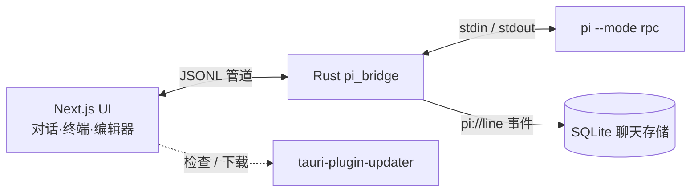

<div align="center">
  
  <h1>Pi Desktop</h1>
  <p><b>为 <code>pi</code> 编程智能体打造的 iOS 风格桌面客户端。</b></p>
  <p>对话、终端、编辑器与项目文件，统一在一个毛玻璃窗口里，驱动的是<b>真实</b>的 <code>pi</code> CLI。</p>
  <p>
    <a href="https://github.com/MarshallEriksen-Neura/pi-agent-desktop/releases">下载</a>
    ·
    <a href="#快速开始">快速开始</a>
    ·
    <a href="#工作原理">工作原理</a>
    ·
    <a href="#社区与更新">社区</a>
    ·
    <a href="./README.md">English</a>
  </p>
</div>

<p align="center">
  
  
  
  
</p>


## 为什么是 Pi Desktop

多数「AI 编程」工具，要么是把聊天框缝进编辑器，要么是一个需要重新学习的重型 IDE。Pi Desktop 走了另一条路：它是**一个薄薄的、原生外壳，把你已经在用的 `pi` CLI 包起来**，让它在桌面上真正安家。

- **跑的是真实 `pi`。** 不是重造轮子，也不是网页套壳。Rust 层 spawn `pi --mode rpc` 并用管道桥接，CLI 的全部能力都在手边。
- **懂得退到后台。** 无边框、透明、毛玻璃质感窗口，配自定义窗口控制 —— 为的是让你工作时它「消失」。
- **共享同一上下文。** 对话能读到实时终端，编辑器里就是代码，文件只在侧栏之外一步之遥，彼此不再割裂。

## 核心特性

- **iOS 风格界面** —— 无边框 / 透明窗口（mica / acrylic），自定义窗口控制，动效由 `motion` 驱动。
- **真实 `pi` 进程** —— Rust 侧 spawn `pi --mode rpc`，JSONL 双向管道接入；浏览器里也可用 Mock 传输直接预览。
- **内置终端** —— xterm 终端与聊天共享上下文，智能体能直接看到 shell 现场。
- **代码编辑器** —— CodeMirror 6，支持语法高亮与代码块交互。
- **本地优先持久化** —— SQLite 保存聊天记录，完全离线可用。
- **内置自动更新** —— 基于 `tauri-plugin-updater`，构建自动生成签名 `latest.json`，应用内一键更新。
- **审阅式 Git 工作流** —— Repository Inspector 将 Fetch 与集成分开，并在本地与 SSH 仓库上提供不可变审阅的仅快进、Merge commit 和线性 Rebase。
- **真正跨平台** —— 一次构建产出 Windows（NSIS / MSI）、macOS（DMG）、Linux（AppImage / deb / rpm）。

## 快速开始

> [!NOTE]
> Pi Desktop 是 `pi` CLI 的图形界面，需本机先装好 `pi` —— 桌面端以 RPC 模式调用它。

从 [GitHub Releases](https://github.com/MarshallEriksen-Neura/pi-agent-desktop/releases) 下载对应平台的最新安装包。

#### Windows

下载 `Pi_0.1.0_x64-setup.exe` 或 `Pi_0.1.0_x64_en-US.msi` 运行安装。

> [!WARNING]
> 安装包暂未做代码签名，首次运行若遇 SmartScreen 拦截，点「仍要运行」即可。

#### macOS

下载 `Pi_0.1.0_aarch64.dmg` 或 `Pi_0.1.0_x64.dmg`。

> [!WARNING]
> 当前未做 Apple 公证签名，首次打开需在「系统设置 → 隐私与安全性」中允许，或右键「打开」以绕过 Gatekeeper。

#### Linux

下载 `.AppImage` / `.deb` / `.rpm`，按常规方式安装即可。

### 推荐：装一个会自报行数的 `pi` 编辑工具

```bash
pi install npm:pi-hashline-edit-pro
```

Pi Desktop 会在对话流里每一行文件编辑记录上显示 `+12 −3` 徽标。这个数字按以下优先级取值：

1. **编辑工具在自己结果里上报的行数指标** —— 精确，且调用一结束就拿得到。
2. **磁盘回读** —— 写入后重新读取文件，与写入前的快照做 diff。
3. **工具调用参数** —— 定向替换自带前后文本；整文件写入自带写入后的全文。

[`pi-hashline-edit-pro`](https://github.com/YuGiMob/pi-hashline-edit-pro) 走的是第一条：它的 `replace` 会在结果里返回 `added_lines` / `removed_lines`，徽标直接采用工具自己的核算结果，完全不依赖某次文件读取是否及时完成。

这对锚点式编辑尤其关键。该工具用内容锚点而非文本来标识被删除的行，所以删除行数**在原理上就无法**从调用参数还原 —— 第 3 条路天生走不通，而一旦没有上报的指标，徽标就只能干等第 2 条。

`pi` 内置的 `edit` / `write` 不装它也能正常工作，走第 2、3 条兜底。装上它的收益是：数字即时且精确，而不是取决于一次回读。

## 工作原理



- **Rust 桥接**（`src-tauri/src/pi_bridge.rs`）—— spawn `pi --mode rpc`，把 stdout JSONL 逐行以 `pi://line` 事件发往前端（`pi_send` 写回 stdin）。
- **后端能力层**（`src/lib/backend/`）——桌面与浏览器组合根会在 UI 挂载前，显式注入进程、文件系统、会话、运行时、窗口、通知和更新能力。
- **协议**（`src/lib/pi/protocol.ts`）—— 所有 RPC 命令与事件，严格 JSONL（每行一个 JSON 对象）。
- **状态** —— zustand stores（`usePi` / `chat` / `useUI`），`agent-bridge.ts` 把 pi 工具事件翻译为 UI agent-task 状态。

### 审阅式 Git 工作流

Repository Inspector 有意不提供隐式 Pull。Fetch 需要单独审阅和执行；随后集成使用一个不可变快照，绑定仓库根目录、代次、本地分支与 `HEAD`、上游目标与 OID、merge-base，以及所选策略。

- **仅快进**只对干净且仅落后的分支开放，并使用已审阅的上游 OID。
- **Merge commit**只对干净且真正分叉的历史开放。归一化后的审阅消息必须非空、已去除首尾空白，最多 4096 个 UTF-8 字节，并按审阅值原样保存。
- **线性 Rebase**只对有界、无 merge commit 的已审阅本地提交范围开放，且不接受消息。
- Merge 或 Rebase 冲突只会在 Git 确认对应操作后自动 abort。只有原分支、`HEAD`、操作状态、引用、索引、锁和工作区均验证恢复后，冲突才会报告为安全地未应用；否则按可能已应用处理并强制权威刷新。
- 分组的**全部暂存 / 全部取消暂存**操作只发送一个绑定代次的批请求，其中包含精确审阅过的文件条目及重命名来源。后端会先完整验证 1–4096 个条目和累计 16 KiB 的 UTF-8 路径预算，再执行一次临时索引 Git 操作和一次实时索引安装；不会循环调用单文件写入。
- 冲突会阻止所有暂存写入，并在文件分组旁明确说明。Commit 区域的辅助操作只暂存已审阅的未暂存/未跟踪范围，绝不会把暂存和提交合并。索引安装前发现工作区漂移会按未应用拒绝；远程分派或安装后的不确定状态会强制权威刷新。
- 本地写入要求规范的 `local` 执行目标。SSH Merge/Rebase 要求 launcher revision 13 和 `repository-integration-v2`；SSH 批量暂存要求 launcher revision 14 和独立的 `repository-batch-write-v1` 能力。Launcher revision 15 修复了仅存在于全局配置中的 Git 身份解析；revision 16 为 HTTPS fetch/push 增加经过来源验证、禁止交互的 Git Credential Manager 访问，同时写操作仍与任意全局/系统 Git 配置隔离。联网子进程会绑定到经过来源验证的 Git 可执行文件，并通过绝对路径调用已审阅的规范 GCM 可执行文件；网络访问前会拒绝仓库本地 credential helper 和全部仓库本地 `http.*` 设置，防止 header、cookie、客户端密钥或代理绕过仅允许 GCM 的边界。审阅后的多引用 fetch 使用原子引用更新。Push 会固定已审阅的提交和目标，验证已审阅上游的祖先关系，并使用带预期 OID 的精确 lease，使远端并发变化安全失败。Phase 3、集成和批量回复都必须是单一、严格且与操作匹配的 JSON 文档。
- 会检查实际生效的 Git 配置，包括 include 和 worktree 作用域；可执行 filter、merge driver、已配置 merge option、hooks、编辑器、签名提示、autostash、rerere、update-refs 与子模块递归会被拒绝或禁用。

集成过程不发起网络请求、不做 force 更新、不 autostash，也不自动解决冲突。集成回复一旦丢失、格式错误或语义含糊，就按可能已应用处理并强制权威刷新。

前端为 Next.js App Router 静态导出（`output: "export"`），所有页面客户端渲染；无边框窗口的装饰由应用自身绘制。

## 自动更新

桌面端内置 `tauri-plugin-updater`：

- 三平台构建时对每个安装包生成 `.sig` 签名（minisign，私钥不入库）。
- 发布脚本合成 `latest.json` 上传到 Release。
- 应用内 `check()` 拉取 `latest.json` 校验并下载安装，完成后通过 `tauri-plugin-process` 重启。

## 开发

包管理器使用 pnpm。

```bash
pnpm install        # 安装依赖
pnpm dev            # 浏览器中的 Next.js 开发服务器（使用 mock pi 传输）
pnpm tauri:dev      # 完整桌面应用：启动 pnpm dev + Tauri 窗口（真实 pi 进程）
pnpm build          # Next.js 静态导出到 out/
pnpm tauri:build    # 生产桌面包（会先执行 pnpm build）
pnpm lint           # next lint
pnpm test:backend   # 后端 ports、组合根与平台边界的聚焦测试
```

Rust 侧检查：

```bash
cd src-tauri && cargo check
```

## 社区与更新

认同 `真诚`、`友善`、`团结`、`专业`，欢迎加入 [LinuxDo](https://linux.do/latest)。

Pi Desktop 进展持续更新在：[GitHub Releases](https://github.com/MarshallEriksen-Neura/pi-agent-desktop/releases)
