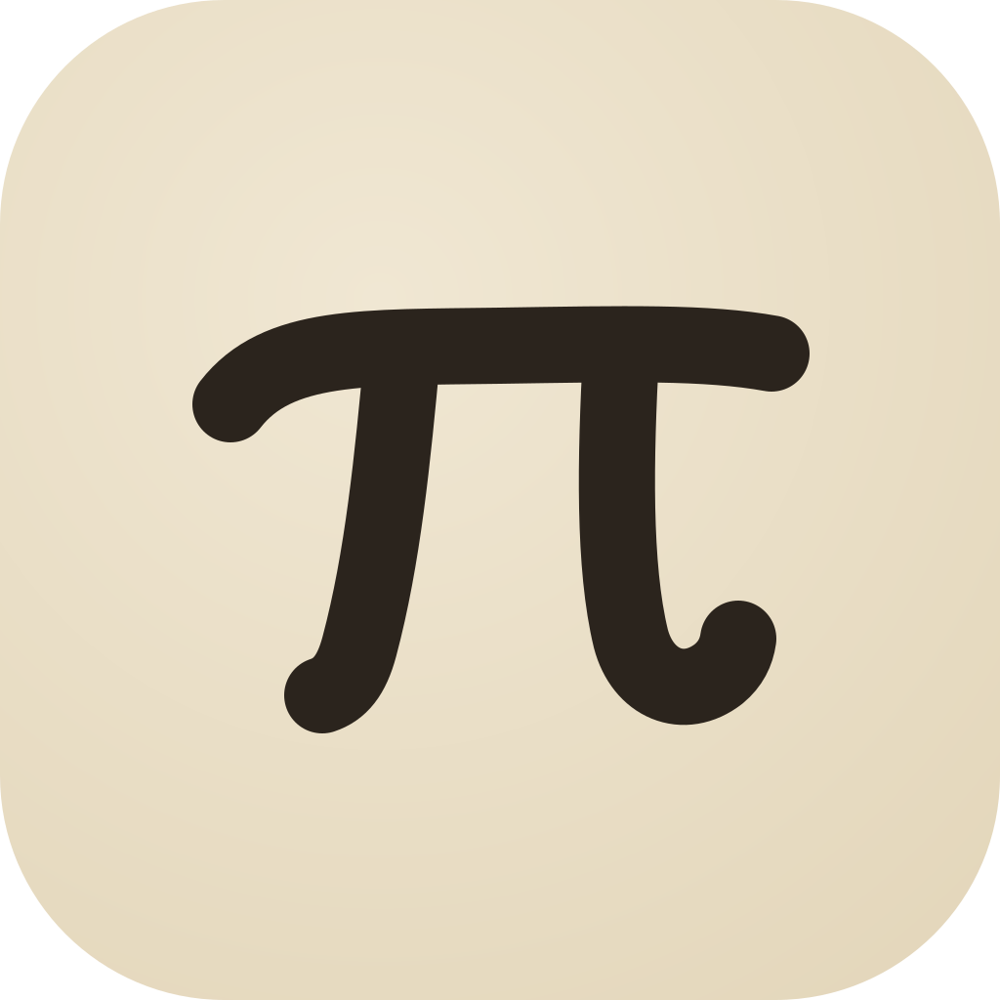
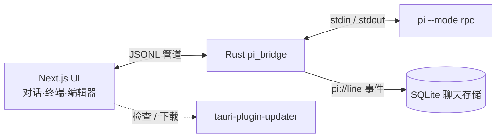

<div align="center">
  
  <h1>Pi Desktop</h1>
  <p><b>为 <code>pi</code> 编程智能体打造的 iOS 风格桌面客户端。</b></p>
  <p>对话、终端、编辑器与项目文件，统一在一个毛玻璃窗口里，驱动的是<b>真实</b>的 <code>pi</code> CLI。</p>
  <p>
    <a href="https://github.com/MarshallEriksen-Neura/pi-agent-desktop/releases">下载</a>
    ·
    <a href="#快速开始">快速开始</a>
    ·
    <a href="#工作原理">工作原理</a>
    ·
    <a href="#社区与更新">社区</a>
    ·
    <a href="./README.md">English</a>
  </p>
</div>

<p align="center">
  
  
  
  
</p>

## 演示

<div align="center">
  <video src="./media/pi-video.mp4" controls width="760">
    你的浏览器不支持 video 标签，可<a href="./media/pi-video.mp4">点此下载</a>。
  </video>
  <p><i>Pi Desktop 实际效果 —— AI 对话、实时终端与代码编辑器共享同一工作区。</i></p>
</div>

## 为什么是 Pi Desktop

多数「AI 编程」工具，要么是把聊天框缝进编辑器，要么是一个需要重新学习的重型 IDE。Pi Desktop 走了另一条路：它是**一个薄薄的、原生外壳，把你已经在用的 `pi` CLI 包起来**，让它在桌面上真正安家。

- **跑的是真实 `pi`。** 不是重造轮子，也不是网页套壳。Rust 层 spawn `pi --mode rpc` 并用管道桥接，CLI 的全部能力都在手边。
- **懂得退到后台。** 无边框、透明、毛玻璃质感窗口，配自定义窗口控制 —— 为的是让你工作时它「消失」。
- **共享同一上下文。** 对话能读到实时终端，编辑器里就是代码，文件只在侧栏之外一步之遥，彼此不再割裂。

## 核心特性

- **iOS 风格界面** —— 无边框 / 透明窗口（mica / acrylic），自定义窗口控制，动效由 `motion` 驱动。
- **真实 `pi` 进程** —— Rust 侧 spawn `pi --mode rpc`，JSONL 双向管道接入；浏览器里也可用 Mock 传输直接预览。
- **内置终端** —— xterm 终端与聊天共享上下文，智能体能直接看到 shell 现场。
- **代码编辑器** —— CodeMirror 6，支持语法高亮与代码块交互。
- **本地优先持久化** —— SQLite 保存聊天记录，完全离线可用。
- **内置自动更新** —— 基于 `tauri-plugin-updater`，构建自动生成签名 `latest.json`，应用内一键更新。
- **真正跨平台** —— 一次构建产出 Windows（NSIS / MSI）、macOS（DMG）、Linux（AppImage / deb / rpm）。

## 快速开始

> [!NOTE]
> Pi Desktop 是 `pi` CLI 的图形界面，需本机先装好 `pi` —— 桌面端以 RPC 模式调用它。

从 [GitHub Releases](https://github.com/MarshallEriksen-Neura/pi-agent-desktop/releases) 下载对应平台的最新安装包。

#### Windows

下载 `Pi_0.1.0_x64-setup.exe` 或 `Pi_0.1.0_x64_en-US.msi` 运行安装。

> [!WARNING]
> 安装包暂未做代码签名，首次运行若遇 SmartScreen 拦截，点「仍要运行」即可。

#### macOS

下载 `Pi_0.1.0_aarch64.dmg` 或 `Pi_0.1.0_x64.dmg`。

> [!WARNING]
> 当前未做 Apple 公证签名，首次打开需在「系统设置 → 隐私与安全性」中允许，或右键「打开」以绕过 Gatekeeper。

#### Linux

下载 `.AppImage` / `.deb` / `.rpm`，按常规方式安装即可。

## 工作原理



- **Rust 桥接**（`src-tauri/src/pi_bridge.rs`）—— spawn `pi --mode rpc`，把 stdout JSONL 逐行以 `pi://line` 事件发往前端（`pi_send` 写回 stdin）。
- **传输层**（`src/lib/pi/client.ts`）—— `TauriTransport`（真实进程）/ `MockTransport`（浏览器预览）在运行时按 `isTauri()` 切换。
- **协议**（`src/lib/pi/protocol.ts`）—— 所有 RPC 命令与事件，严格 JSONL（每行一个 JSON 对象）。
- **状态** —— zustand stores（`usePi` / `chat` / `useUI`），`agent-bridge.ts` 把 pi 工具事件翻译为 UI agent-task 状态。

前端为 Next.js App Router 静态导出（`output: "export"`），所有页面客户端渲染；无边框窗口的装饰由应用自身绘制。

## 自动更新

桌面端内置 `tauri-plugin-updater`：

- 三平台构建时对每个安装包生成 `.sig` 签名（minisign，私钥不入库）。
- 发布脚本合成 `latest.json` 上传到 Release。
- 应用内 `check()` 拉取 `latest.json` 校验并下载安装，完成后通过 `tauri-plugin-process` 重启。

## 开发

包管理器使用 pnpm。

```bash
pnpm install        # 安装依赖
pnpm dev            # 浏览器中的 Next.js 开发服务器（使用 mock pi 传输）
pnpm tauri:dev      # 完整桌面应用：启动 pnpm dev + Tauri 窗口（真实 pi 进程）
pnpm build          # Next.js 静态导出到 out/
pnpm tauri:build    # 生产桌面包（会先执行 pnpm build）
pnpm lint           # next lint
```

Rust 侧检查：

```bash
cd src-tauri && cargo check
```

## 社区与更新

认同 `真诚`、`友善`、`团结`、`专业`，欢迎加入 [LinuxDo](https://linux.do/latest)。

Pi Desktop 进展持续更新在：[GitHub Releases](https://github.com/MarshallEriksen-Neura/pi-agent-desktop/releases)
